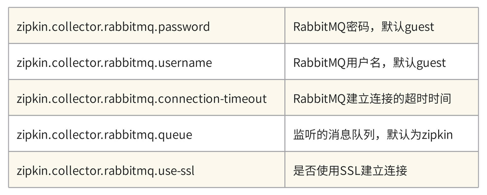
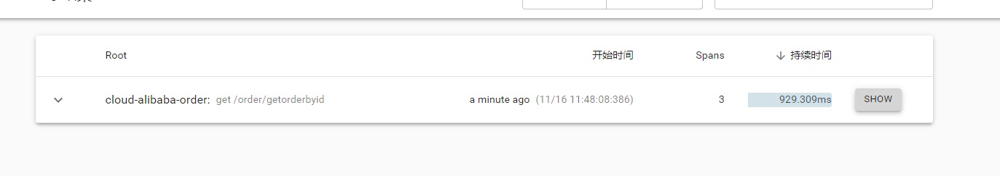

# spring boot 项目 集成 nacos 实现配置管理

> 参考链接：  
[1.spring 整合nacos](https://blog.csdn.net/weixin_44033066/article/details/129043571?utm_medium=distribute.pc_relevant.none-task-blog-2~default~baidujs_baidulandingword~default-0-129043571-blog-127871025.235^v38^pc_relevant_sort_base1&spm=1001.2101.3001.4242.1&utm_relevant_index=3)

## 1 nacos 安装 (linux)

安装位置 192.168.1.225 /opt/bssoft/nacos/nacos
> 参考文档:  
[Nacos安装配置详细流程](https://blog.csdn.net/qq_52830988/article/details/128319218)

### 1.1 下载nacos

* 选择与springboot 和 cloud
  对应的nacos [版本对照](https://github.com/alibaba/spring-cloud-alibaba/wiki/%E7%89%88%E6%9C%AC%E8%AF%B4%E6%98%8E)
  ;
* 下载选择 Assets 下的包
  

```shell
wget https://github.com/alibaba/nacos/releases/download/1.4.1/nacos-server-1.4.1.tar.gz
```

### 1.2 解压

进入压缩包所在的文件夹:

```shell
[root@localhost ~]# cd /opt/bssoft/nacos
```

把文件解压到/opt/bssoft/nacos 目录下:

```shell
 tar -zxvf nacos-server-1.2.1.zip
 unzip nacos-server-1.2.1.zip
```

### 1.3 启动

进入 bin目录

```shell
#非集群启动
./startup.sh -m standalone
```

### 1.4 关闭

```shell
./shutdown.sh
```

### 1.5 测试访问

默认用户名密码 nacos/nacos

```shell
http://192.168.1.225:8848/nacos
```

### 1.6 设置开机自启

#### 1.6.1 创建 nacos.service文件

```shell
vim /lib/systemd/system/nacos.service

#内容如下
[Unit]
Description=nacos
After=network.target

[Service]
Type=forking
ExecStart=/usr/local/nacos/bin/startup.sh -m standalone
ExecReload=/usr/local/nacos/bin/shutdown.sh
ExecStop=/usr/local/nacos/bin/shutdown.sh
PrivateTmp=true

[Install]
WantedBy=multi-user.target

```

#### 1.6.2 修改nacos启动文件startup.sh

```shell
[ ! -e "$JAVA_HOME/bin/java" ] && JAVA_HOME=/usr/local/jdk1.8.0_191 
#[ ! -e "$JAVA_HOME/bin/java" ] && JAVA_HOME=/usr/java
#[ ! -e "$JAVA_HOME/bin/java" ] && JAVA_HOME=/opt/taobao/java
#[ ! -e "$JAVA_HOME/bin/java" ] && unset JAVA_HOME

```

#### 1.6.3 重启 使配置生效

```shell
systemctl daemon-reload        #重新加载服务配置
systemctl enable nacos.service #设置为开机启动
systemctl start nacos.service  #启动nacos服务
systemctl stop nacos.service   #停止nacos服务
systemctl status nacos.service   #查看nacos服务的状态

```

## 2. nacos 持久化

Nacos默认有自带嵌入式数据库derby，但是如果做集群模式的话，就不能使用自己的数据库不然每个节点一个数据库，那么数据就不统一了，需要使用外部的mysql

### 2.1 配置nacos持久化

#### 2.1.1 修改 application.properties配置

增加支持mysql数据源配置（目前只支持mysql，版本要求：5.6.5+）; 文件位置： nacos/conf/application.properties

```yml
#*************** Config Module Related Configurations ***************#
### If user MySQL as datasource:
spring.datasource.platform=mysql

  ### Count of DB:

db.num=1
db.url.0=jdbc:mysql://192.168.1.188:3306/pc_coare0610ttt?characterEncoding=utf8&connectTimeout=1000&socketTimeout=3000&autoReconnect=true&useUnicode=true&useSSL=false&serverTimezone=UTC
  #db.url.1=jdbc:mysql://11.163.152.9:3306/nacos_devtest?characterEncoding=utf8&connectTimeout=1000&socketTimeout=3000&autoReconnect=true&useUnicode=true&useSSL=false&serverTimezone=UTC
db.user=root
db.password=root
```

#### 2.1.2 初始化nacos脚本

初始化nacos 脚本

```java
/nacos/conf 下的nacos-mysql.sql脚本
```

#### 2.1.2 重启nacos

我重启后之前配置的配置信息不见了？

```java

```

## 3. spring boot集成 nacos

### 3.1 引入依赖

* 注意 springboot 、springcloud Alibaba 、以及nacos 对应的版本。

```xml

<parent>
    <groupId>org.springframework.boot</groupId>
    <artifactId>spring-boot-starter-parent</artifactId>
    <version>2.3.12.RELEASE</version>
    <relativePath/> <!-- lookup parent from repository -->
</parent>
```

```xml

<com.alibaba.cloud.alibaba.nacos>2.1.0.RELEASE</com.alibaba.cloud.alibaba.nacos>
<com.alibaba.cloud.alibaba.dependencies>2.2.9.RELEASE</com.alibaba.cloud.alibaba.dependencies>
```

```xml

<dependency>
    <groupId>com.alibaba.cloud</groupId>
    <artifactId>spring-cloud-alibaba-dependencies</artifactId>
    <version>${com.alibaba.cloud.alibaba.dependencies}</version>
    <type>pom</type>
    <scope>import</scope>
</dependency>

        <!-- 注册中心 -->
<dependency>
<groupId>com.alibaba.cloud</groupId>
<artifactId>spring-cloud-starter-alibaba-nacos-discovery</artifactId>
<version>${com.alibaba.cloud.alibaba.nacos}</version>
</dependency>
        <!-- 配置中心 -->
<dependency>
<groupId>com.alibaba.cloud</groupId>
<artifactId>spring-cloud-starter-alibaba-nacos-config</artifactId>
<version>${com.alibaba.cloud.alibaba.nacos}</version>
</dependency>
```

### 3.2 修改配置以及启动类

启动类增加注解：

```java
@EnableDiscoveryClient // 开启nacos
```

配置文件名称改为 bootstrap.yaml,配置如下

```yaml
server:
  port: 8888
  servlet:
    context-path: /configManager
  compression:
    enabled: true
    mime-types: application/json
    min-response-size: 2048

spring:
  application:
    name: configManager
  cloud:
    nacos:
      discovery:
        server-addr: 192.168.1.225:8848
      config:
        server-addr: 192.168.1.225:8848
        #指定分组 根据项目分组
        group: DEFAULT_GROUP
        #指定文件名，没有则默认${spring.application.name}
        #指定读取配置中心文件后缀
        file-extension: yaml
  profiles:
    active: dev
```

### 3.3 在nacos 配置 配置文件

在配置列表，点击“新增”
> Data ID = spring.application.name + '-' + spring.profiles.active + '.' + spring.cloud.nacos.config.file-extension  
> Group = spring.cloud.nacos.config.group  
> 增加配置信息  
> 点击发布，则会同步配置到项目，可通过日志查看是否生效

### 3.4 共享配置

```text
    服务名.yaml 将 系统同一配置写在里面 
```

### 3.5 配置优先级



## 4. nacos 控制台的基本使用

[Nacos--详解以及使用（全网最全）](https://blog.csdn.net/maoheguxiang/article/details/129718265)

## 5. nacos 用法 example

[Nacos--详解以及使用（全网最全）](https://blog.csdn.net/maoheguxiang/article/details/129718265)

### 5.1 热配置 用例

#### 5.1。1 @value 注解

在使用@Value注入值的类上增加注解@RefreshScope

```java
@RefreshScope

@Value("${system.test.shardvalue}")
private String shardvalue;
```

#### 5.1.2 @ConfigurationProperties 注解

```java

@Component
@Data
@ConfigurationProperties(prefix = "system.test")
public class SystemTestProperties {
    private String shardvalue;
}
```

### 5.2 共享配置

    生成一个 applicant.yaml 的文件 ，在nacos 新增对应的配置

### 5.3 注册中心

#### 5.3.1 在配置文件中配置nacos为配置中心

```yaml
spring:
  application:
    name: spring-boot-demo-nacos-provider
  cloud:
    nacos:
      discovery:
        server-addr: 192.168.1.225:8848
        # 集群
#        cluster-name: test
#        namespace: configManager
```

#### 5.3.2 dubbo 注册中心配置为 nacos

```yaml
dubbo:
  application:
    name: spring-boot-demo-nacos-provider
  #  scan:
  #    base-packages: com.zhangz.springbootdemonacosprovider.service.impl
  protocols:
    dubbo:
      name: dubbo
      port: 20881
  registry:
    address: nacos://${spring.cloud.nacos.discovery.server-addr}
    group: nacosDemo
 ```

#### 5.3.3 启动类

```java
@EnableDiscoveryClient // 开启nacos
@EnableDubbo 
```

#### 5.3.4 提供者

```java
// 在service上增加注解
@DubboService
```

#### 5.3.5 消费者

```java
// 使用 @DubboReference 注解
@DubboReference
private TestService testService;
```

## Fegin 远程调用

### 简介

> Feign是Spring Cloud提供的一个声明式的伪Http客户端， 它使得调用远程服务就像调用本地服务 一样简单， 只需要创建一个接口并添加一个注解即可。 Nacos很好的兼容了Feign， Feign默认集成了 Ribbon， 所以在Nacos下使用Fegin默认就实现了负 载均衡的效果。

### 引入maven依赖

```xml
<!--fegin组件-->
<dependency>
    <groupId>org.springframework.cloud</groupId>
    <artifactId>spring-cloud-starter-openfeign</artifactId>
</dependency>
```

### 开启feign

```java
//启动类增加注解
@EnableFeignClients 
```

### demo 实例

1.编写接口

```java
   @GetMapping("/getProductByName")
@ResponseBody
public String getProductByName(@RequestParam("productName") String productName){
        log.info("getProductByName params  productName:{}",productName);
        List<Product> productList=productService.getProductByName(productName);
        return JSON.toJSONString(productList);
        }
```

2.在调用的服务增加feign接口

```java

@RefreshScope
@FeignClient(name = "cloud-alibaba-product", url = "${cloudAlibaba.service.product.address}")
public interface FeignProductService {
    // 指定调用提供者的哪个方法
    // @FeignClient+@GetMapping 就是一个完整的请求路径 http://localhost:8888/cloud-alibaba-product/getProductByName
    @GetMapping("/product/getProductByName")
    String getProductByName(@RequestParam("productName") String productName);
}
```

3. 增加配置文件 这里我增加到了 all-server.yaml 文件中，每个服务的地址应该都是一样的，可以共用

```yaml
cloudAlibaba:
  allServer:
    publicConfig: 12423423234234
  service:
    product:
      address: localhost:8888/cloud-alibaba-product
```

## Sentinel--服务容错

### 常见的容错策略

1. 隔离
2. 超时
3. 限流
4. 熔断
5. 降级

### 常见的容错组件

1. Hystrix
2. Resilience4J
3. Sentnel

### 集成sentinel

1. 在maven 加入依赖

```xml

<!--熔断 sentinel -->
<dependency>
    <groupId>com.alibaba.cloud</groupId>
    <artifactId>spring-cloud-starter-alibaba-sentinel</artifactId>
    <version>2.2.4.RELEASE</version>
</dependency>
<dependency>
<groupId>org.springframework.boot</groupId>
<artifactId>spring-boot-starter-actuator</artifactId>
<version>2.2.5.RELEASE</version>
</dependency>

```

2. 修改配置文件

```yaml
spring:
  application:
    name: cloud-alibaba-order
  cloud:
    sentinel:
      transport:
        port: 8179 # 同控制台交互的地址
        dashboard: 127.0.0.1:8080 # 控制台地址
      eager: true
```

3. 启动 sentinel 客户端

> 项目地址： sentinel-dashboard-zk
> 访问地址： http://localhost:8080/#/dashboard/degrade/sentinel-dashboard  sentinel\sentinel

4. 模拟限流

> 4.1 登录到sentinel控制台  
4.2 在簇点链路中选择需要限流的接口  
4.3 点击流控 ，增加限流规则  
4.4 可通过 jmeter 模拟并发请求，同时查看后台访问日志 (可限制并发数为1 ，这样能够明显看到日志减少)
也可以同时swagger请求同一接口，返回 （Blocked by Sentinel (flow limiting)）

## feign 整合 sentinel

1. 增加依赖

```xml
<!--sentinel客户端-->
<dependency>
    <groupId>com.alibaba.cloud</groupId>
    <artifactId>spring-cloud-starter-alibaba-sentinel</artifactId>
</dependency>
```

2. 在配置文件中开启feign对sentinel的支持

```yaml
feign:
  sentinel:
    enabled: true
```

3. 创建feign service接口的容错实现类

```java
/**
 * @author 100451
 *  熔断接口实现 
 *  1.容错类 必须实现需要容错的所有接口 ， 并且实现容错方案
 */
@Component
@Slf4j
public class FeignProductServiceFallBack implements FeignProductService {
    @Override
    public String getProductByName(String productName) {
        log.warn("proudct server method getProductByName fallback ,params proudctName :{} ", productName);
        Product fallback = Product.builder().pid("-1").pname("fallback").build();
        return JSON.toJSONString(fallback);
    }

    @Override
    public String getProductById(String pid) {
        log.warn("proudct server method getProductById fallback ,params pid :{} ", pid);
        Product fallback = Product.builder().pid("-1").pname("fallback").build();
        return JSON.toJSONString(fallback);
    }
}
```

4. feign 调用service接口上指定容错类

```java
/**
 *  fallback 指定容错类
 */
@RefreshScope
@FeignClient(name = "cloud-alibaba-product", url = "${cloudAlibaba.service.product.address}", fallback = FeignProductServiceFallBack.class)
public interface FeignProductService {
    // 指定调用提供者的哪个方法
    // @FeignClient+@GetMapping 就是一个完整的请求路径 http://localhost:8888/cloud-alibaba-product/getProductByName
    @GetMapping("/product/getProductByName")
    String getProductByName(@RequestParam("productName") String productName);

    @GetMapping("/product/getProductById")
    String getProductById(@RequestParam("pid") String pid);
}
```

## gateway

1. 引入maven依赖

* 需注意删除spring-boot-start-web相关依赖

```xml

<dependency>
    <groupId>org.springframework.cloud</groupId>
    <artifactId>spring-cloud-starter-gateway</artifactId>
</dependency>
```

* 引入nacos 配置中心

```xml
 <!-- 注册中心 -->
<dependency>
    <groupId>com.alibaba.cloud</groupId>
    <artifactId>spring-cloud-starter-alibaba-nacos-discovery</artifactId>
</dependency>

        <!-- 配置中心 -->
<dependency>
<groupId>com.alibaba.cloud</groupId>
<artifactId>spring-cloud-starter-alibaba-nacos-config</artifactId>
</dependency>
<dependency>
<groupId>org.springframework.cloud</groupId>
<artifactId>spring-cloud-starter-loadbalancer</artifactId>
</dependency>

```

2. 启动类增加 注解

```java
@EnableDiscoveryClient
```

3. 编写配置文件

```yaml
spring:
  application:
    name: cloud-alibaba-gateway
  cloud:
    gateway:
      filter:
        remove-hop-by-hop:
          headers:
            # 以下是去掉网关默认去掉的请求响应头
            - trailer
            - te
            - keep-alive
            - transfer-encoding
            - upgrade
            - proxy-authenticate
            - connection
            - proxy-authorization
            - x-application-context
            # 以下是去掉服务层面定义的跨域
            - access-control-allow-credentials
            - access-control-allow-headers
            - access-control-allow-methods
            - access-control-allow-origin
            - access-control-max-age
            - vary
      globalcors:
        corsConfigurations:
          '[/**]':
            allowCredentials: true
            allowedOrigins: "*"
            allowedHeaders: "*"
            allowedMethods: "*"
            maxAge: 3628800
      discovery:
        locator:
          enabled: true # 让gateway 可以发现nacos中的微服务
      routes:
        - id: test
          uri: https://www.baidu.com
          order: 1
          predicates:
            - Path=/test/**
          filters:
            - StripPrefix=1

        - id: cloud_product
          # 要转发到的地址 lb是指从nacos中安装名称获取微服务并且遵循负载均衡
          uri: lb://cloud-alibaba-product
          order: 1
          predicates:
            # 当请求路径满足断言时才进行转发 
            - Path=/product/**
          filters:
            # 转发之前去掉一层路径
            - StripPrefix=1
    nacos:
      discovery:
        server-addr: 192.168.1.225:8848
        # 集群
      #        cluster-name: test
      #        namespace: configManager
      config:
        server-addr: 192.168.1.225:8848
        # 指定分组 根据项目分组
        #        group: provider
        # 指定文件名，没有则默认${spring.application.name}
        # 指定读取配置中心文件后缀
        file-extension: yaml
        shared-dataids: all-server.yaml # 配置要引入的配置
        refreshable-dataids: all-server.yaml # 配置需要动态刷新的配置

  profiles:
    active: dev

#暴露端点
management:
  endpoints:
    web:
      exposure:
        include: '*'

```

> - StripPrefix=1  
    例如：（http://127.0.0.1:8181/product/list -> http://192.168.1.100:8086/list），

4. 测试调用

```text
http://localhost:7777/test/
 
http://localhost:7777/product/cloud-alibaba-product/product/getProductById?pid=123123
```

5. 网关限流  
   从1.6.0版本开始，Sentinel提供了SpringCloud Gateway的适配模块，可以提供两种资源维度的限流：
    * route维度：即在Spring配置文件中配置的路由条目，资源名为对应的routeId
    * 自定义API维度：用户可以利用Sentinel提供的API来自定义一些API分组

5.1 引入依赖

```xml

<dependency>
    <groupId>com.alibaba.csp</groupId>
    <artifactId>sentinel-spring-cloud-gateway-adapter</artifactId>
</dependency>
```

5.2 编写限流配置类  
基于Sentinel 的Gateway限流是通过其提供的Filter来完成的，使用时只需注入对应的 SentinelGatewayFilter实例以及 SentinelGatewayBlockExceptionHandler 实例即可。

```java
package com.zhangz.springbootdemocloudalibabagateway.config;

import com.alibaba.csp.sentinel.adapter.gateway.common.SentinelGatewayConstants;
import com.alibaba.csp.sentinel.adapter.gateway.common.api.ApiDefinition;
import com.alibaba.csp.sentinel.adapter.gateway.common.api.ApiPathPredicateItem;
import com.alibaba.csp.sentinel.adapter.gateway.common.api.ApiPredicateItem;
import com.alibaba.csp.sentinel.adapter.gateway.common.api.GatewayApiDefinitionManager;
import com.alibaba.csp.sentinel.adapter.gateway.common.rule.GatewayFlowRule;
import com.alibaba.csp.sentinel.adapter.gateway.common.rule.GatewayRuleManager;
import com.alibaba.csp.sentinel.adapter.gateway.sc.SentinelGatewayFilter;
import com.alibaba.csp.sentinel.adapter.gateway.sc.callback.BlockRequestHandler;
import com.alibaba.csp.sentinel.adapter.gateway.sc.callback.GatewayCallbackManager;
import com.alibaba.csp.sentinel.adapter.gateway.sc.exception.SentinelGatewayBlockExceptionHandler;
import org.springframework.beans.factory.ObjectProvider;
import org.springframework.cloud.gateway.filter.GlobalFilter;
import org.springframework.context.annotation.Bean;
import org.springframework.context.annotation.Configuration;
import org.springframework.core.Ordered;
import org.springframework.core.annotation.Order;
import org.springframework.http.HttpStatus;
import org.springframework.http.MediaType;
import org.springframework.http.codec.ServerCodecConfigurer;
import org.springframework.web.reactive.function.BodyInserters;
import org.springframework.web.reactive.function.server.ServerResponse;
import org.springframework.web.reactive.result.view.ViewResolver;
import org.springframework.web.server.ServerWebExchange;
import reactor.core.publisher.Mono;

import javax.annotation.PostConstruct;
import java.util.*;

/**
 * @author 100451
 */
@Configuration
public class GatewayConfiguration {
    private final List<ViewResolver> viewResolvers;
    private final ServerCodecConfigurer serverCodecConfigurer;

    public GatewayConfiguration(ObjectProvider<List<ViewResolver>> viewResolversProvider, ServerCodecConfigurer serverCodecConfigurer) {
        this.viewResolvers = viewResolversProvider.getIfAvailable(Collections::emptyList);
        this.serverCodecConfigurer = serverCodecConfigurer;
    }

    /**
     * 初始化一个限流的过滤器
     * @return
     */
    @Bean
    @Order(Ordered.HIGHEST_PRECEDENCE)
    public GlobalFilter sentinelGatewayFilter() {
        return new SentinelGatewayFilter();
    }

    /**
     * 配置初始化的限流参数
     */
    @PostConstruct
    public void initGatewayRules() {
        Set<GatewayFlowRule> rules = new HashSet<>();
        // 以路由id为单元
        rules.add(new GatewayFlowRule("cloud_product") // 资源名称,对应路由id
                .setCount(1) // 限流阈值
                .setIntervalSec(1) // 统计时间窗口，单位是秒，默认是 1 秒
        );
        // 以自定义api路径为单元
        rules.add(new GatewayFlowRule("product_api1").setCount(1).setIntervalSec(1));
        rules.add(new GatewayFlowRule("product_api2").setCount(1).setIntervalSec(1));
        GatewayRuleManager.loadRules(rules);
    }

    // 配置限流的异常处理器
    @Bean
    @Order(Ordered.HIGHEST_PRECEDENCE)
    public SentinelGatewayBlockExceptionHandler sentinelGatewayBlockExceptionHandler() {
        return new SentinelGatewayBlockExceptionHandler(viewResolvers, serverCodecConfigurer);
    }

    /**
     * 自定义限流异常页面
     */
    @PostConstruct
    public void initBlockHandlers() {
        BlockRequestHandler blockRequestHandler = new BlockRequestHandler() {
            @Override
            public Mono<ServerResponse> handleRequest(ServerWebExchange serverWebExchange, Throwable throwable) {
                Map map = new HashMap<>();
                map.put("code", 0);
                map.put("message", "接口被限流了");
                return ServerResponse.status(HttpStatus.OK).contentType(MediaType.APPLICATION_JSON_UTF8).body(BodyInserters.fromObject(map));
            }
        };
        GatewayCallbackManager.setBlockHandler(blockRequestHandler);
    }

    // *************** 自定义 api 分组

    // 自定义API分组
    @PostConstruct
    private void initCustomizedApis() {
        Set<ApiDefinition> definitions = new HashSet<>();
        ApiDefinition api1 = new ApiDefinition("product_api1").setPredicateItems(new HashSet<ApiPredicateItem>() {
            {
                // 以/product-serv/product/api1 开头的请求
                add(new ApiPathPredicateItem().setPattern("/product-serv/product/api1/**").setMatchStrategy(SentinelGatewayConstants.URL_MATCH_STRATEGY_PREFIX));
            }
        });
        ApiDefinition api2 = new ApiDefinition("product_api2").setPredicateItems(new HashSet<ApiPredicateItem>() {
            {
                // 以/product-serv/product/api2/demo1 完成的url路径匹配
                add(new ApiPathPredicateItem().setPattern("/product-serv/product/api2/demo1"));
            }
        });
        definitions.add(api1);
        definitions.add(api2);
        GatewayApiDefinitionManager.loadApiDefinitions(definitions);
    }

    // TODO 是否可以通过接口动态的管理限流
}

```

5.3 测试限流效果  
快速调用 http://localhost:7777/cloud-alibaba-product/product/getProductById?pid=123123
返回信息 {"code":0,"message":"接口被限流了"}

## 链路追踪 Sleuth +Zinkin

参考文档：

* [spring cloud 调用链追踪：集成 Sleuth 和 Zipkin，实现链路打标](https://blog.csdn.net/sumguo10qq/article/details/129207291)

### 集成 sleuth

1. 引入maven依赖

```xml
  <!--链路追踪 Sleuth-->
<dependency>
    <groupId>org.springframework.cloud</groupId>
    <artifactId>spring-cloud-starter-sleuth</artifactId>
</dependency>
```

2. 增加配置文件

```yaml
spring:
  # 链路监控
  sleuth:
    log:
      slf4j:
        enabled: true
    sampler:
      # 采样率的概率， 100%采样
      probability: 1.0
      # 每秒采样数字最高为1000
      rate: 1000

```

3. 启动项目 调用请求

* 查看控制台日志

> 2023-11-16 11:20:51.183  INFO [cloud-alibaba-order,b6e2419f74aaa0e3,b6e2419f74aaa0e3,true] 40236 --- [nio-9999-exec-1] c.z.s.controller.OrderController         : getOrderById params  orderId:u5etr  
> 2023-11-16 11:20:51.183  INFO [serverId,traceId,spanId,true]

## 整合zipkin

### zipkin 服务端安装启动

1.下载zipkin-server
> 下载地址  
https://search.maven.org/remote_content?g=io.zipkin&a=zipkin-server&c=exec&v=2.23.9

2.命令行启动 zipkin-server  
zipkin-server 内置了rabbitMQ 默认的RavvitMQ 的账号密码都是guset/guest 队列是 zipkin，  
可通过下列参数 修改 :


```shell
# 连接 RabbitmQ 
java -jar zipkin-server-2.23.9-exec.jar --zipkin.collector.rabbitmq.addresses=localhost:5672
# 单独启动
java -jar zipkin-server-2.23.9-exec.jar
```

3. 浏览器访问控制台

```text
http://localhost:9411
```

### zipkin 客户端集成

1.引入maven依赖

```xml

<dependency>
    <groupId>org.springframework.cloud</groupId>
    <artifactId>spring-cloud-starter-zipkin</artifactId>
</dependency>
```

2. 增加配置

```yaml
spring:
  zipkin:
    base-url: http://localhost:9411/ #zipkin server的请求地址
    discovery-client-enabled: false # 让nacos把她当作一个url而不是服务名
```

3. 重启项目 调用接口 查看控制台
   

4. zipkin 数据持久化  
   参考文档：
    * [JavaEdge Docker搭建Zipkin，实现数据持久化到MySQL、ES](https://zhuanlan.zhihu.com/p/652677976)
   > zipkin-server 数据默认保存在内存中的，最大存储为50000个span.  
   zipkin 天然支持cassandra elasticsearch 以及 MySQL三种持久化方式。  
   [zipkin 配置](https://github.com/openzipkin/zipkin/blob/master/zipkin-server/src/main/resources/zipkin-server-shared.yml)  
   [持久化版本对照](https://link.zhihu.com/?target=https%3A//github.com/openzipkin/zipkin%25EF%25BC%258C%25E5%258F%25AF%25E6%259F%25A5%25E7%259C%258B%25EF%25BC%259A)

4.1 mysql 持久化   
4.1.1 新建数据 zipkin 并且初始化建表脚本

[MySQL建表语句参考](https://link.zhihu.com/?target=https%3A//github.com/openzipkin/zipkin/blob/master/zipkin-storage/mysql-v1/src/main/resources/mysql.sql)

4.1.2 修改启动命令 增加MySQL 信息

```shell
docker run \
--name zipkin-server -d \
--restart=always \
-p 9411:9411 \
-e MYSQL_USER=root \
-e MYSQL_PASS=lhzlx \
-e MYSQL_HOST=111.229.160.175 \
-e STORAGE_TYPE=mysql \
-e MYSQL_DB=zipkin \
-e MYSQL_TCP_PORT=3316 \
openzipkin/zipkin:2.21.7```

4.1.3 启动项目并且调用后查看数据库进行验证    

4.2 es 持久化

4.2.1 无需建表 只需启动时指定es配置

```shell
  java -DSTORAGE_TYPE=elasticsearch -DES_HOSTS=http://192.168.2.14:9200 -jar  zipkin-server-2.23.9-exec.jar > publish.log &
```

4.2.2 重启zipkin-server 后调用服务 查询es

```shell
GET zipkin-span-2023-11-16/_search
```

## 消息驱动 - rabbitMQ

参考文档：

* [秃秃头头:SpringCloud项目整合RabbitMQ](https://blog.csdn.net/weixin_43028393/article/details/129818186)
* [codeLearn:Spring Cloud 集成 RabbitMQ ](https://www.cnblogs.com/codeLearn/p/16964708.html)

1. 应用场景

* 异步接口
* 流量消峰

2. 引入maven依赖

```xml

<dependency>
    <groupId>org.springframework.cloud</groupId>
    <artifactId>spring-cloud-stream-binder-rabbit</artifactId>
</dependency>
<dependency>
<groupId>org.springframework.cloud</groupId>
<artifactId>spring-cloud-starter-stream-rabbit</artifactId>
</dependency>

```

3. 增加配置信息

```yaml
spring:
  rabbitmq:
    host: 192.168.1.166
    port: 5672
    username: guest
    password: guest
```

4. 发送消息

```java

@Autowired
private RabbitTemplate rabbitTemplate;


        // 订单生成以后 发送消息通知用户 已下单
        rabbitTemplate.convertAndSend(MQConfig.ORDER_RUTEKEY,"订单【"+orderId+"】已下单！");

```
5. 接收消息
```java
@Slf4j
@Component
public class MqReceiveService {

    /**
     * 接收订单下单后 发送用户通知的消息
     * 当队列不存在时自动创建并且自动绑定exchange
     * @param message 消息体
     */
    @RabbitListener(bindings = {@QueueBinding(value = @Queue(MQConfig.ORDER_QUEUE), exchange = @Exchange(MQConfig.ORDER_EXCHANGE), key = MQConfig.ORDER_RUTEKEY)})
    public void orderNotion(String message) {
        log.info("接收到消息体|{}", message);
    }
}
```
