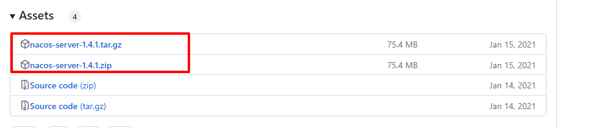

# spring boot 项目 集成 nacos 实现配置管理

> 参考链接：  
[1.spring 整合nacos](https://blog.csdn.net/weixin_44033066/article/details/129043571?utm_medium=distribute.pc_relevant.none-task-blog-2~default~baidujs_baidulandingword~default-0-129043571-blog-127871025.235^v38^pc_relevant_sort_base1&spm=1001.2101.3001.4242.1&utm_relevant_index=3)

## 1 nacos 安装 (linux)

> 参考文档:  
[Nacos安装配置详细流程](https://blog.csdn.net/qq_52830988/article/details/128319218)

### 1.1 下载nacos

* 选择与springboot 和 cloud
  对应的nacos [版本对照](https://github.com/alibaba/spring-cloud-alibaba/wiki/%E7%89%88%E6%9C%AC%E8%AF%B4%E6%98%8E)
  ;
* 下载选择 Assets 下的包
  

```shell
wget https://github.com/alibaba/nacos/releases/download/1.4.1/nacos-server-1.4.1.tar.gz
```

### 1.2 解压

进入压缩包所在的文件夹:

```shell
[root@localhost ~]# cd /opt/bssoft/nacos
```

把文件解压到/opt/bssoft/nacos 目录下:

```shell
 tar -zxvf nacos-server-1.2.1.zip
 unzip nacos-server-1.2.1.zip
```

### 1.3 启动

进入 bin目录

```shell
#非集群启动
./startup.sh -m standalone
```

### 1.4 关闭

```shell
./shutdown.sh
```

### 1.5 测试访问

默认用户名密码 nacos/nacos

```shell
http://192.168.1.225:8848/nacos
```

### 1.6 设置开机自启

#### 1.6.1 创建 nacos.service文件

```shell
vim /lib/systemd/system/nacos.service

#内容如下
[Unit]
Description=nacos
After=network.target

[Service]
Type=forking
ExecStart=/usr/local/nacos/bin/startup.sh -m standalone
ExecReload=/usr/local/nacos/bin/shutdown.sh
ExecStop=/usr/local/nacos/bin/shutdown.sh
PrivateTmp=true

[Install]
WantedBy=multi-user.target

```

#### 1.6.2 修改nacos启动文件startup.sh

```shell
[ ! -e "$JAVA_HOME/bin/java" ] && JAVA_HOME=/usr/local/jdk1.8.0_191 
#[ ! -e "$JAVA_HOME/bin/java" ] && JAVA_HOME=/usr/java
#[ ! -e "$JAVA_HOME/bin/java" ] && JAVA_HOME=/opt/taobao/java
#[ ! -e "$JAVA_HOME/bin/java" ] && unset JAVA_HOME

```

#### 1.6.3 重启 使配置生效

```shell
systemctl daemon-reload        #重新加载服务配置
systemctl enable nacos.service #设置为开机启动
systemctl start nacos.service  #启动nacos服务
systemctl stop nacos.service   #停止nacos服务
systemctl status nacos.service   #查看nacos服务的状态

```

## 2. nacos 持久化

Nacos默认有自带嵌入式数据库derby，但是如果做集群模式的话，就不能使用自己的数据库不然每个节点一个数据库，那么数据就不统一了，需要使用外部的mysql

### 2.1 配置nacos持久化

#### 2.1.1 修改数据库

增加支持mysql数据源配置（目前只支持mysql，版本要求：5.6.5+）; 文件位置： nacos/conf/application.properties

```yml

```

## 3. spring boot集成 nacos

### 3.1 引入依赖

* 注意 springboot 、springcloud Alibaba 、以及nacos 对应的版本。

```xml

<parent>
    <groupId>org.springframework.boot</groupId>
    <artifactId>spring-boot-starter-parent</artifactId>
    <version>2.3.12.RELEASE</version>
    <relativePath/> <!-- lookup parent from repository -->
</parent>
```

```xml

<com.alibaba.cloud.alibaba.nacos>2.1.0.RELEASE</com.alibaba.cloud.alibaba.nacos>
<com.alibaba.cloud.alibaba.dependencies>2.2.9.RELEASE</com.alibaba.cloud.alibaba.dependencies>
```

```xml

<dependency>
    <groupId>com.alibaba.cloud</groupId>
    <artifactId>spring-cloud-alibaba-dependencies</artifactId>
    <version>${com.alibaba.cloud.alibaba.dependencies}</version>
    <type>pom</type>
    <scope>import</scope>
</dependency>

        <!-- 注册中心 -->
<dependency>
<groupId>com.alibaba.cloud</groupId>
<artifactId>spring-cloud-starter-alibaba-nacos-discovery</artifactId>
<version>${com.alibaba.cloud.alibaba.nacos}</version>
</dependency>
        <!-- 配置中心 -->
<dependency>
<groupId>com.alibaba.cloud</groupId>
<artifactId>spring-cloud-starter-alibaba-nacos-config</artifactId>
<version>${com.alibaba.cloud.alibaba.nacos}</version>
</dependency>
```

### 3.2 修改配置以及启动类

启动类增加注解：

```java
@EnableDiscoveryClient // 开启nacos
```

配置文件名称改为 bootstrap.yaml,配置如下

```yaml
server:
  port: 8888
  servlet:
    context-path: /configManager
  compression:
    enabled: true
    mime-types: application/json
    min-response-size: 2048

spring:
  application:
    name: configManager
  cloud:
    nacos:
      discovery:
        server-addr: 192.168.1.225:8848
      config:
        server-addr: 192.168.1.225:8848
        #指定分组 根据项目分组
        group: DEFAULT_GROUP
        #指定文件名，没有则默认${spring.application.name}
        #指定读取配置中心文件后缀
        file-extension: yaml
  profiles:
    active: dev
```

### 3.3 在nacos 配置 配置文件

在配置列表，点击“新增”
> Data ID = spring.application.name + '-' + spring.profiles.active + '.' + spring.cloud.nacos.config.file-extension  
> Group = spring.cloud.nacos.config.group  
> 增加配置信息  
> 点击发布，则会同步配置到项目，可通过日志查看是否生效

## 4. nacos 控制台的基本使用
[Nacos--详解以及使用（全网最全）](https://blog.csdn.net/maoheguxiang/article/details/129718265)


## 5. nacos 用法 example 
### 5.1  热配置 用例
#### 5.1 @value 注解 
  在使用@Value注入值的类上增加注解@RefreshScope
```java
@RefreshScope

@Value("${system.test.shardvalue}")
private String shardvalue;
```
#### @ConfigurationProperties 注解
```java

@Component
@Data
@ConfigurationProperties(prefix = "system.test")
public class SystemTestProperties {
    private String shardvalue;
}
```

